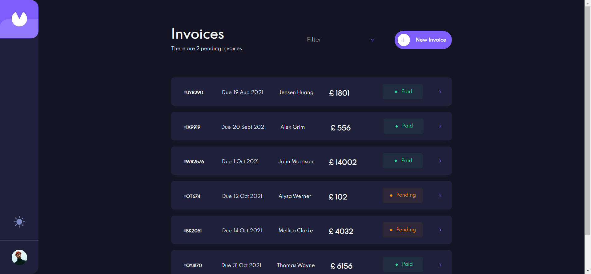
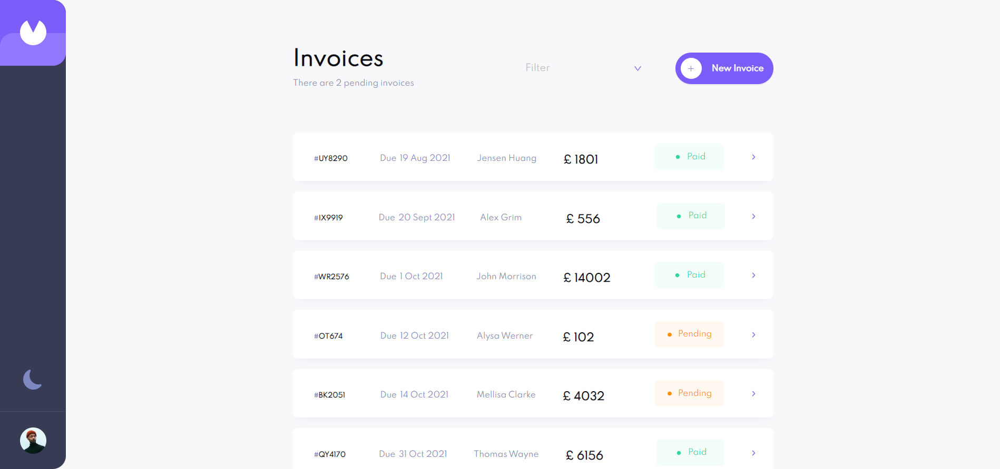
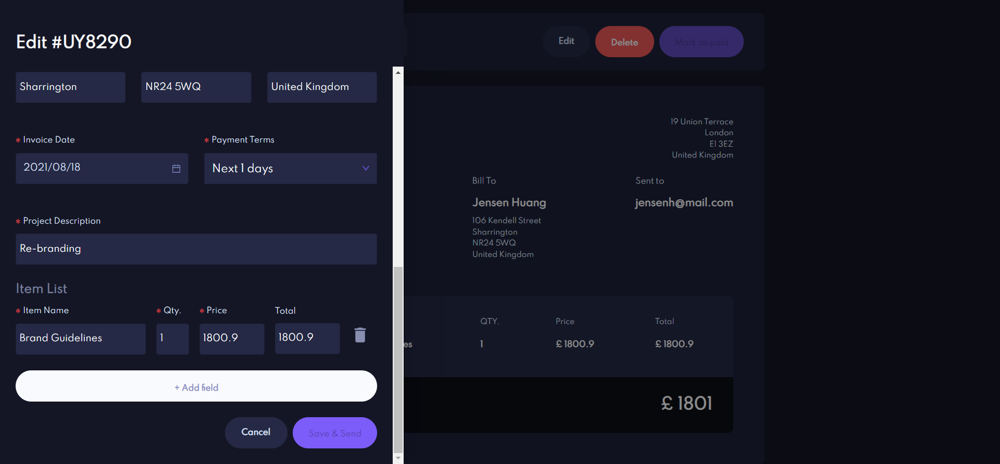
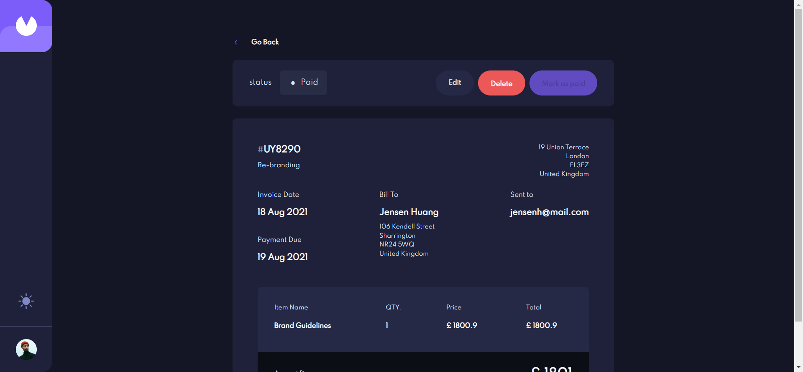

# Frontend Mentor - Invoice app solution

This is a solution to the [Invoice app challenge on Frontend Mentor](https://www.frontendmentor.io/challenges/invoice-app-i7KaLTQjl). Frontend Mentor challenges help you improve your coding skills by building realistic projects.

## Table of contents

- [Overview](#overview)
    - [The challenge](#the-challenge)
    - [Screenshot](#screenshot)
    - [Links](#links)
- [My process](#my-process)
    - [Built with](#built-with)
    - [REST APIs](#rest-apis)
    - [What I learned](#what-i-learned)

## Overview

### The challenge

Users should be able to:

- View the optimal layout for the app depending on their device's screen size
- See hover states for all interactive elements on the page
- Create, read, update, and delete invoices
- Receive form validations when trying to create/edit an invoice
- Save draft invoices, and mark pending invoices as paid
- Filter invoices by status (draft/pending/paid)
- Toggle light and dark mode

### Screenshot

### Links

- Solution URL: [Frontend Mentors-Invoices App](https://www.frontendmentor.io/solutions/responsive-invoices-app-using-reactjs-with-antd-fBxndcuv8E)
- Live Site URL: [Frontend Mentors Invoices App](https://frontend-mentors-invoices-app.netlify.app/)

## My process

### Built with

- [React](https://reactjs.org/) - JS library
- [Antd](https://ant.design/docs/react/introduce) - For styles

### REST APIs

- Backend for this project is built using NodeJS and MongoDB
- It is deployed on HerokuApp: https://frontend-mentors-invoices-app.herokuapp.com

### What I learned

- Using Redux & context apis in React.js
- Building a multi-theme website using React with Antd
- Setup Routes with React router
- Using Antd in styling and customizing in it.
- Using Antd Forms and its validations
